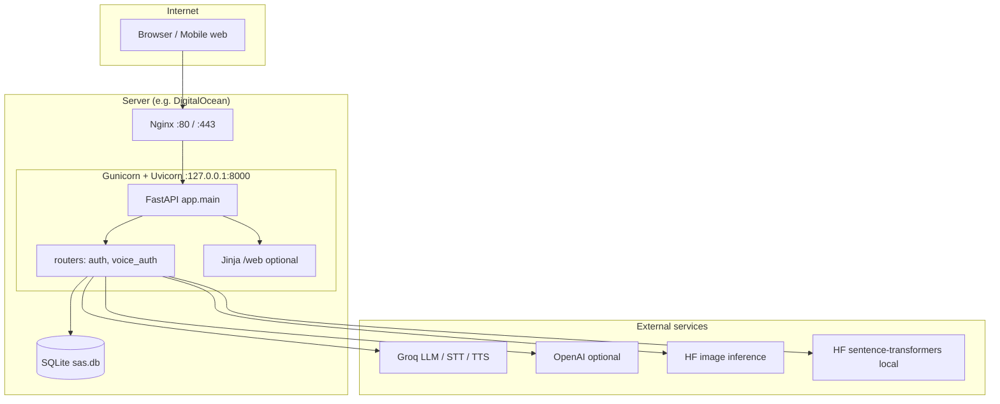
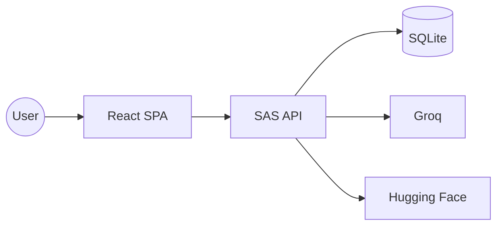

# System Architecture — SAS (Mermaid)

## Logical deployment (production-style)

---

## Component responsibilities

| Layer | Responsibility |
|-------|----------------|
| **React SPA** | Routes, multi-step login UI, profile, `localStorage` JWT, optional `VITE_API_BASE`. |
| **Nginx** | TLS termination, reverse proxy, body size limits, static ACME path. |
| **FastAPI** | HTTP API, CORS, mounts `/static`, optional SPA `frontend/dist`. |
| **SQLAlchemy / SQLite** | Users, secrets, challenges, gallery blobs, events. |
| **Security module** | Fernet encryption for embeddings / summaries at rest. |
| **Semantic pipeline** | Embeddings + LLM scoring + lockout policy. |
| **Greeting image module** | HF (or configured provider) image generation + decoys. |

---

## System context (alternative view)

For formal **C4** models (Context / Container / Component), copy containers from the diagram above into Structurizr, PlantUML C4, or draw.io.
