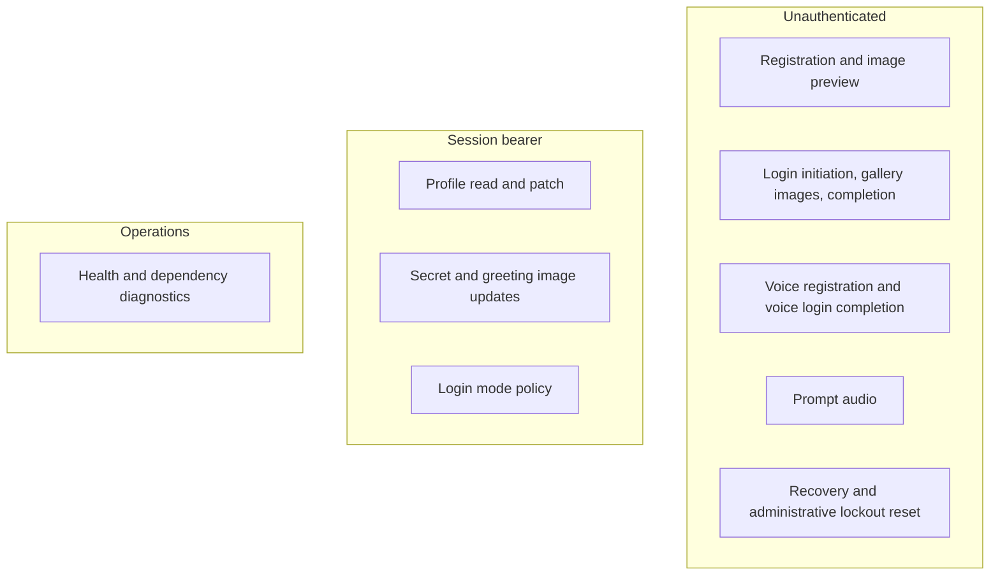
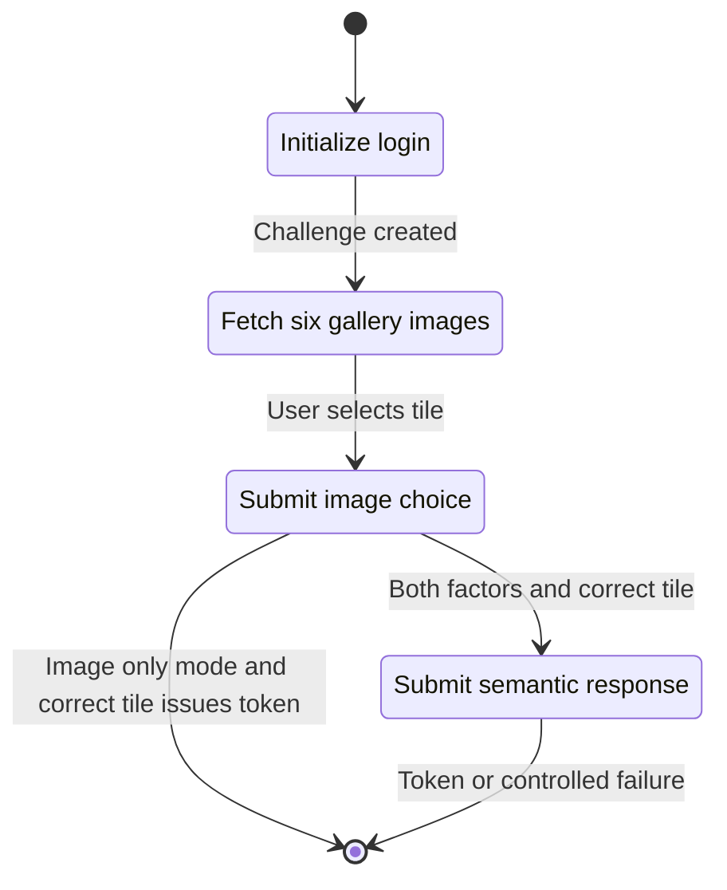
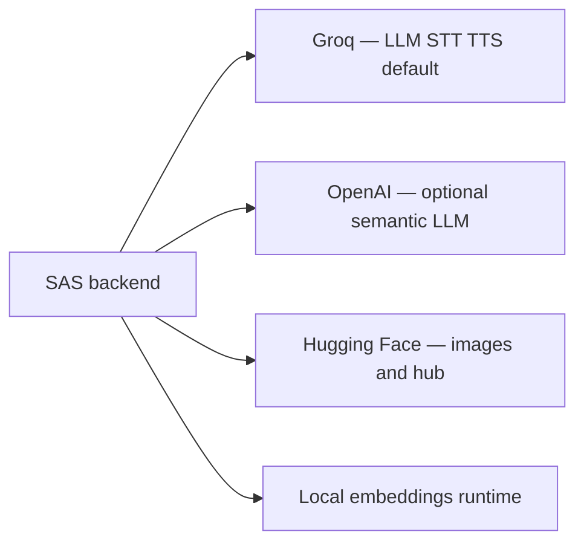

# API architecture — Semantic Authentication System (SAS)

The public HTTP API is grouped under **`/auth`** for registration, login, profile, recovery, and speech artefacts, with **`/health`** for readiness. A separate **HTML** surface may exist under **`/web`** for form-based experiments; the primary product flow is the JSON API consumed by the single-page application.

---

## 1. Resource groups and trust

---

## 2. Login orchestration vs HTTP steps

---

## 3. Semantic provider on the wire

| Aspect | Behaviour |
|--------|-----------|
| **Default** | Semantic summarisation and login-time similarity use **Groq** when no override is present. |
| **OpenAI** | Supported semantic routes accept a client indication to use **OpenAI** instead; the service must have OpenAI credentials configured. |
| **Voice bodies** | Multipart uploads for spoken registration and spoken login completion; JSON for text paths. |

---

## 4. Endpoint catalogue

| Method | Path | Authentication |
|--------|------|------------------|
| POST | `/auth/register` | None |
| POST | `/auth/register/preview-greeting-image` | None |
| POST | `/auth/voice/register` | None |
| POST | `/auth/login/init` | None |
| POST | `/auth/voice/login/init` | None |
| GET | `/auth/login/challenge/{id}/gallery-image/{slot}` | None |
| POST | `/auth/login/challenge/{id}/pick-greeting-image` | None |
| POST | `/auth/login/complete` | None |
| POST | `/auth/voice/login/complete` | None |
| GET | `/auth/tts/prompt/{challenge_id}` | None |
| GET | `/auth/profile` | Bearer session |
| PATCH | `/auth/profile` | Bearer session |
| POST | `/auth/profile/secret` | Bearer session |
| POST | `/auth/profile/secret/voice` | Bearer session |
| POST | `/auth/profile/greeting-image` | Bearer session |
| GET | `/auth/profile/greeting-image` | Bearer session |
| POST | `/auth/profile/login-mode` | Bearer session |
| POST | `/auth/recovery/unlock/request` | None |
| POST | `/auth/recovery/unlock/confirm` | None |
| GET | `/auth/reset/{identifier}` | Administrative shared secret query parameter |
| GET | `/health` | None |
| GET | `/health/image-generation` | None |
| GET | `/health/hf-env` | None |

---

## 5. Outbound service dependencies

Together, these integrations implement **usable** semantic authentication with **inclusive** modalities while keeping provider choice explicit for study and deployment scenarios.
