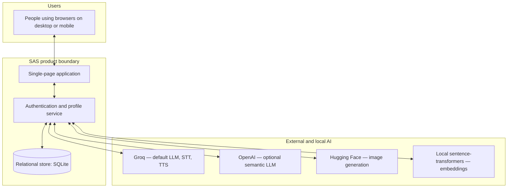
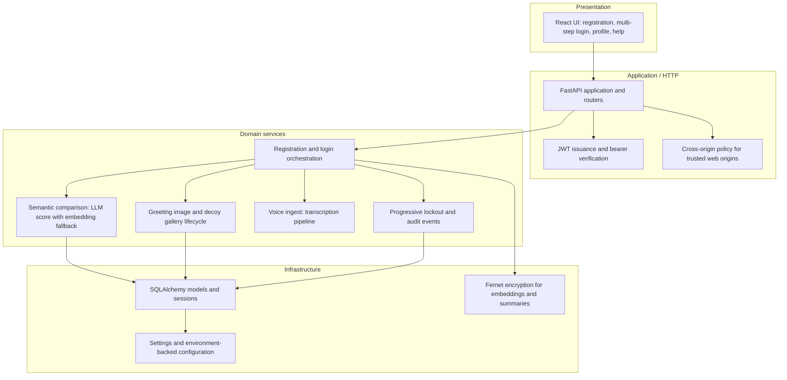
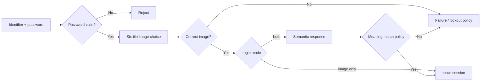
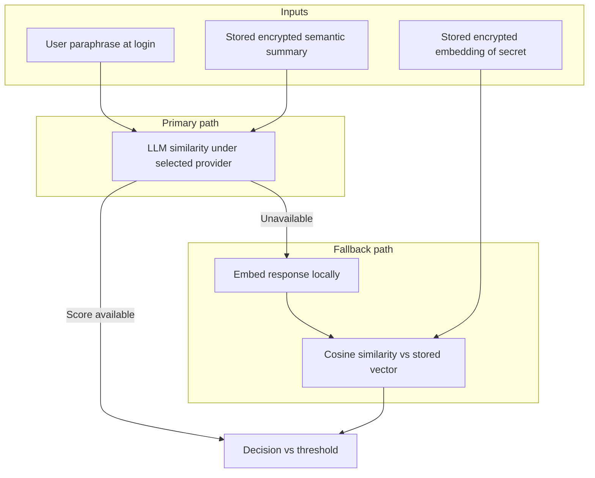

# Software architecture: Semantic Authentication System (SAS)

SAS is a **web-centric** semantic authentication prototype: a browser client talks to a **Python** service that combines **classical credentials**, **meaning-based verification**, and a **visual recognition** step. **Groq** is the default provider for conversational LLM tasks, speech-to-text, text-to-speech, and related semantic scoring; **OpenAI** can serve the same semantic summarisation and similarity role when selected and configured. **Hugging Face** backs image generation and model hub access; **sentence-transformers** runs locally for dense embeddings and as a **fallback** when the primary semantic score is unavailable.

---

## 1. Logical system context

---

## 2. Layered application structure

---

## 3. Sign-in assurance pipeline (conceptual dataflow)

---

## 4. Semantic verification stack

The **selected provider** is **Groq** unless the client requests **OpenAI** for semantic routes and the deployment exposes OpenAI credentials.

---

## 5. Component responsibilities

| Part | Responsibility |
|------|------------------|
| **Web client** | Guided flows, optional OpenAI/Groq preference for semantic calls, secure token storage in the browser, accessibility affordances (voice, TTS). |
| **HTTP surface** | REST JSON and multipart for voice; optional legacy HTML flows under a separate path prefix. |
| **Authentication core** | Password hashing, challenge lifecycle, JWT contents, profile updates. |
| **Semantic core** | Summary generation at enrolment; similarity at verification; similarity bands for logging. |
| **Visual security** | User-level gallery pool; per-challenge copies; regeneration after successful login where applicable. |
| **Persistence** | Users, embeddings, challenges, binary image slots, anonymised login events. |
| **Cryptography** | Encryption of material that must not appear as plaintext at rest. |

---

## 6. Trust boundaries

- **Browser:** holds short-lived session token; never receives server-side API keys for Groq, OpenAI, or Hugging Face.
- **SAS service:** holds credentials to AI providers and encryption keys; must run in a controlled host environment.
- **Data store:** holds encrypted semantic artefacts and binary images; not raw user secrets in clear text for the summary field.
