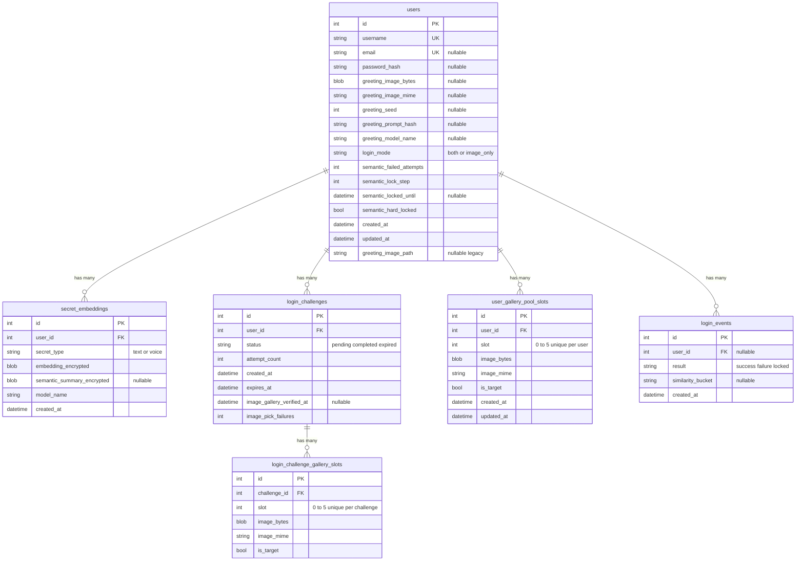

# Persistence schema — Semantic Authentication System (SAS)

The SAS persistence model stores accounts, encrypted semantic artefacts, per-login challenges with six binary image slots, a per-user pre-generated gallery pool, and anonymised login outcomes. The diagram below is the **conceptual schema** implemented in the application layer.

## Entity–relationship model

## Integrity rules

- Each **username** is unique; **email**, when present, is unique.
- Gallery tiles are uniquely keyed by **(challenge_id, slot)** and **(user_id, slot)** for challenge and pool tables respectively.

## Schema evolution

The shipped application may add columns or tables on startup when older files are opened, so that existing study databases gain new fields without a separate migration tool. The diagram represents the **intended** relational shape after a successful run.
