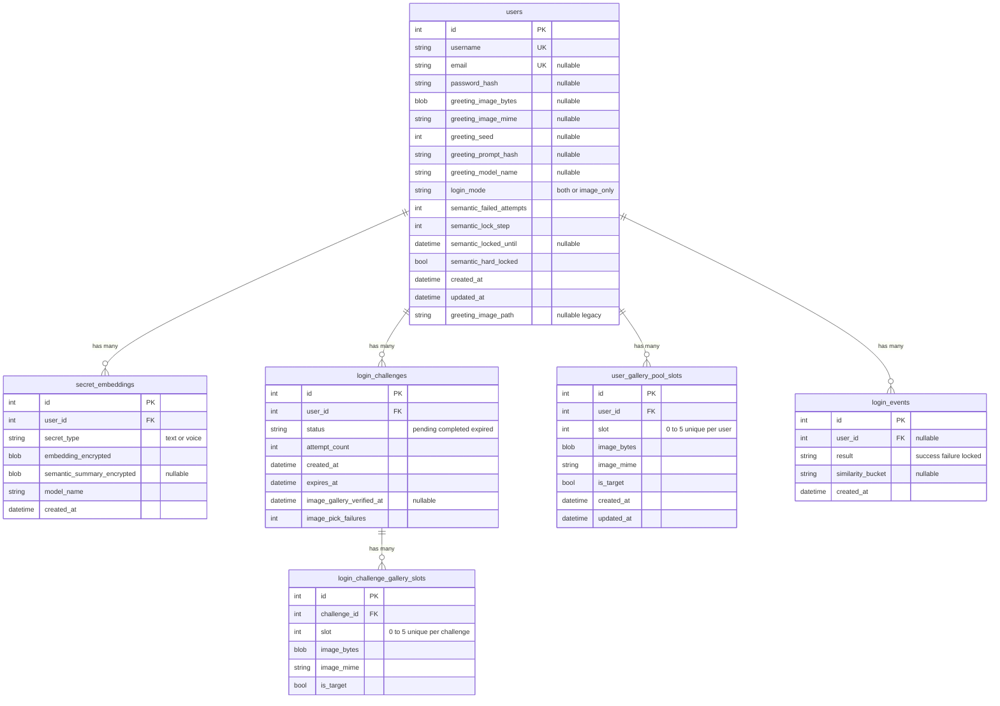

# Database Schema

Here's the data model we use to store accounts, encrypted semantic data, login challenges (with their 6 image tiles), pre-generated galleries, and login event logs. The diagram below shows the core structure.

## Entity–relationship model

## Integrity rules

- **usernames** are always unique. If an **email** is provided, it must also be unique.
- Image tiles have unique combinations of **(challenge_id, slot)** or **(user_id, slot)** so we don't accidentally double-book a slot.

## Schema evolution

We handle migrations automatically on startup. If you spin up an older database, the app just adds whatever new columns it needs behind the scenes so you don't have to worry about running separate migration scripts. The diagram above shows the final expected structure.
