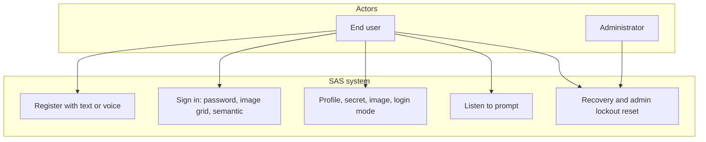
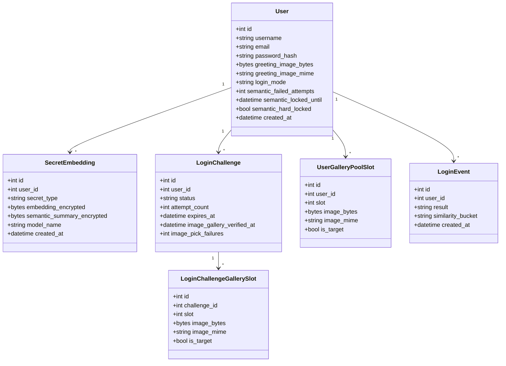
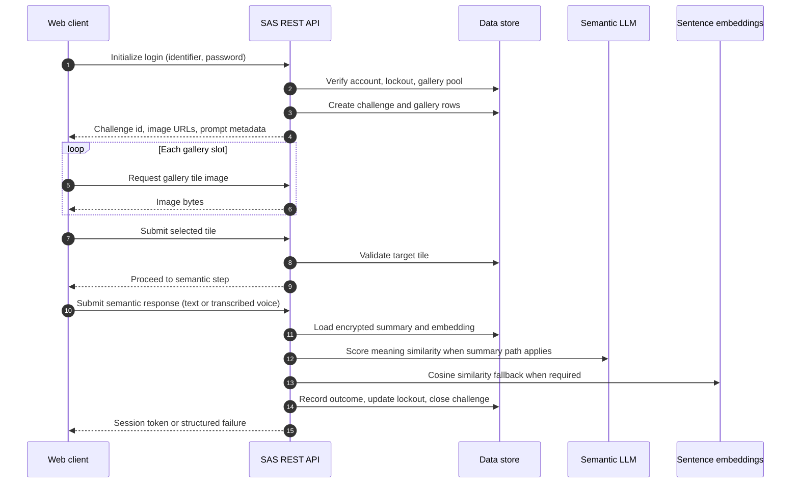
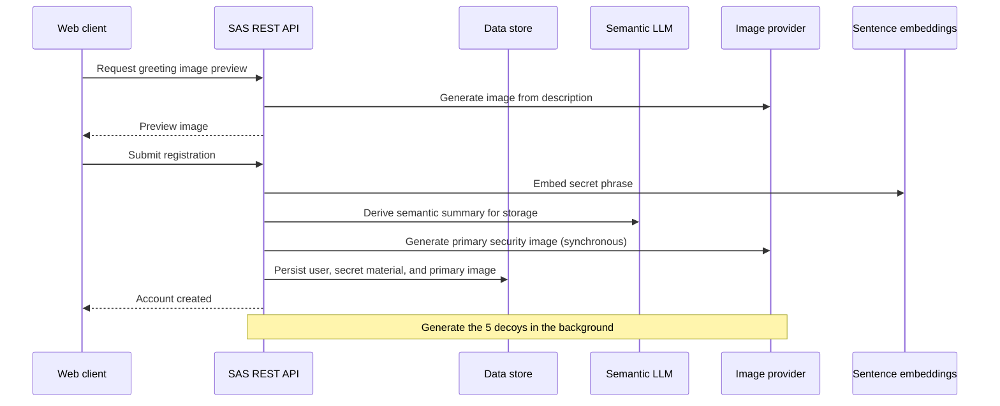
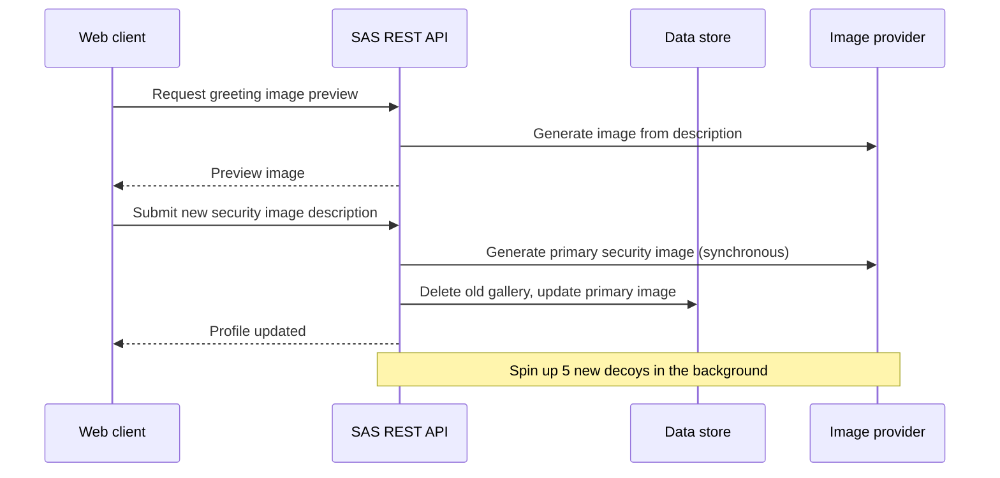
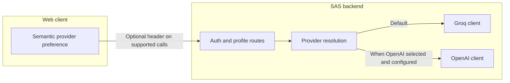
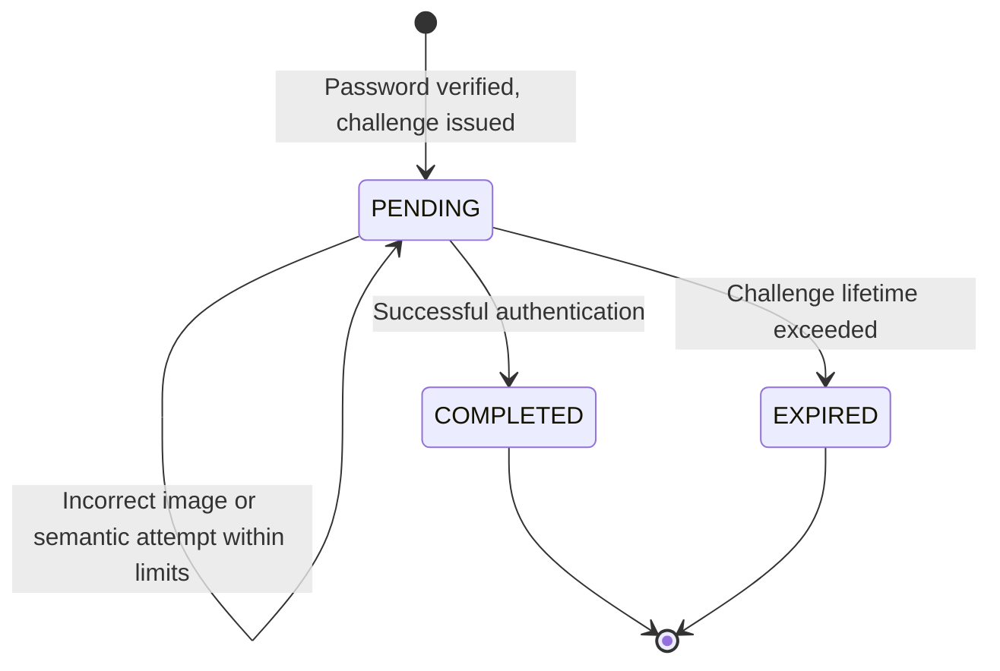

# UML views Semantic Authentication System (SAS)

Figures in this document are **Mermaid** diagrams embedded in Markdown.

---

## 1. High-level use cases

---

## 2. Domain class diagram (persistence entities)

---

## 3. Sequence: Sign-in (both factors: password → image → semantic)

---

## 4. Sequence: Registration with text secret (conceptual)

---

## 5. Sequence: Profile Security Image Update

---

## 6. Semantic LLM provider (Groq vs OpenAI)

Default semantic operations use **Groq**. When the client marks **OpenAI** for semantic scoring and summarisation and the deployment supplies OpenAI credentials, those operations use **OpenAI** instead for the same contracts.

---

## 7. State machine — Login challenge lifecycle

